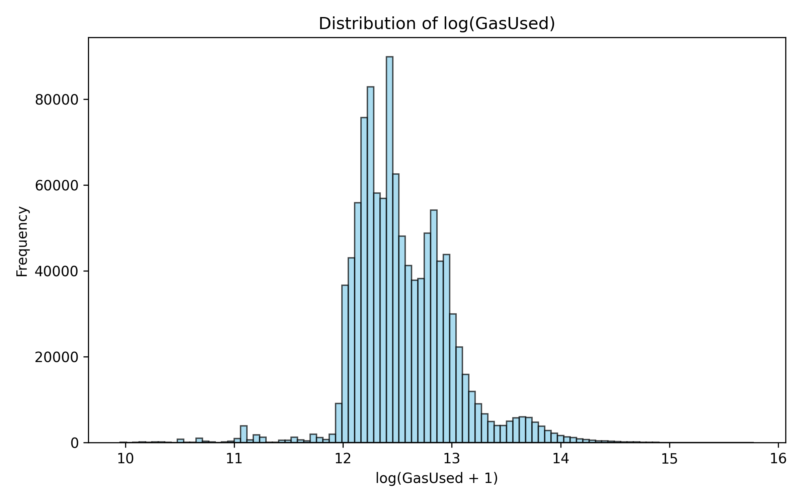
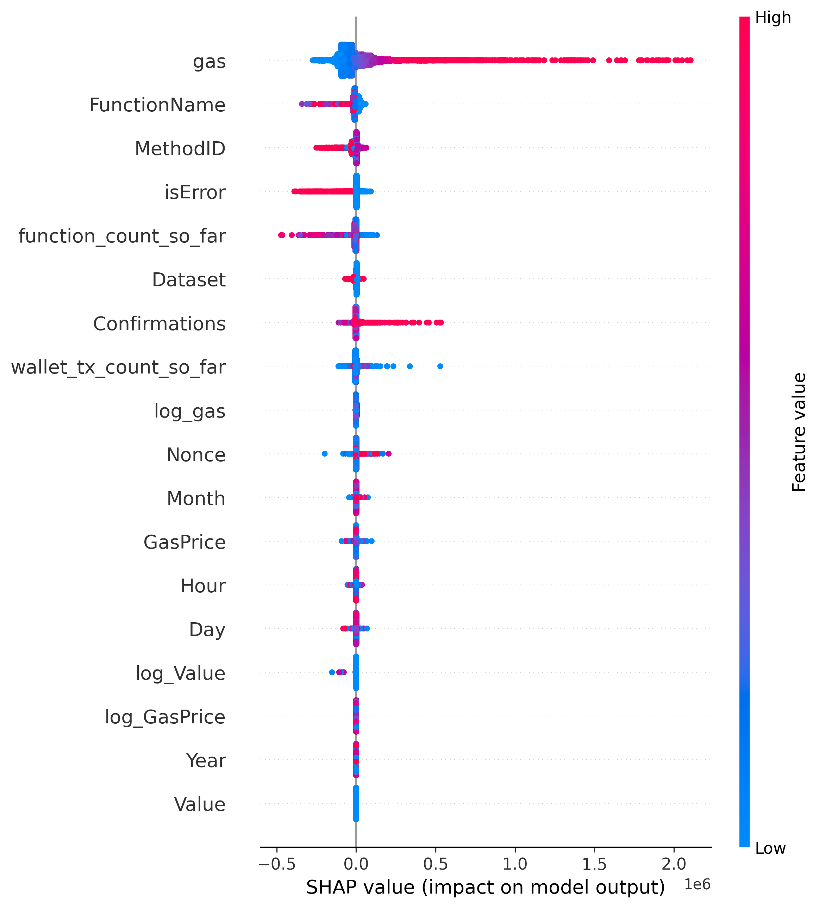

# Decentralizing Reputation Scoring Using Blockchain Behavioral Data and Machine Learning

This repository contains the  final codebase for my thesis work titled *“Decentralizing Reputation Scoring Using Blockchain Behavioral Data and Machine Learning,”* which was published at ICAISET 2026.

Here, I implement and demonstrate the core concepts of the paper, combining blockchain-based decentralization with behavioral data and machine learning techniques to build a transparent and reliable reputation scoring system.

## Results Preview

### Gas Usage Distribution

  

This figure shows the distribution of the transformed gas usage target used during model training.

### SHAP Feature Importance Summary

  

This figure highlights the most influential features contributing to the reputation scoring model.

## Full Notebook Output

The full model outputs, execution results, and notebook walkthrough are available on Kaggle:

[View the Kaggle notebook](https://www.kaggle.com/code/ahmedmshakil/thesiswork-ml-blockchain-reputation-scoring)

## Author

**Shakil Ahmed**

* LinkedIn: [@ahmedmshakil](https://www.linkedin.com/in/ahmedmshakil/)
* GitHub: [@ahmedmshakil](https://github.com/ahmedmshakil)
